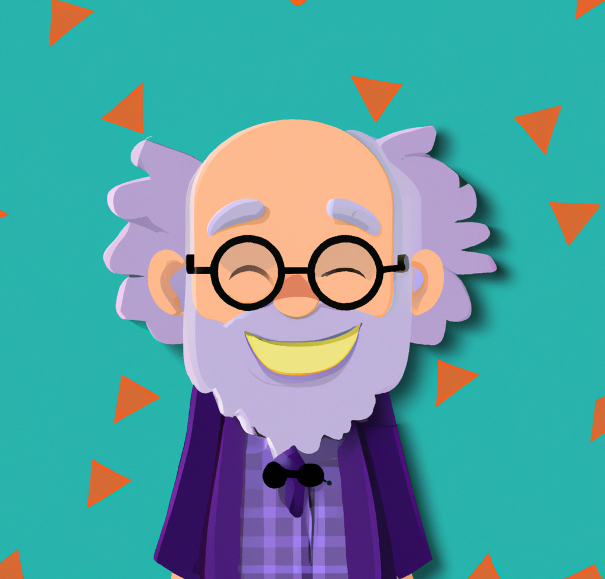

# Python-Discord-AI-Chat-Bot

### What is it?
A discord chat bot that can respond dynamically and creatively in conversations with discord users.

### Purpose:
To save time by no longer needing to login and connect to the OpenAI website to speak to a chat bot, while also providing an entertaining and convenient experience to discord users who want a chat bot on their server.

### What Inspired this Project?

I previously developed a Discord chat bot using Node.js and a chat API from a small team. Initially, I hosted the bot on repl.it, but due to the 5-minute sleep intervals, I decided to migrate it to Heroku for its Dyno hours which allows for smooth operation within the free tier. I believe this was a better choice for the long-term operation of the bot.

With the rise of ChatGPT, I decided it was time to create a new discord chat bot and use Python this time as well as a new hosting service to run it since Heroku no longer has free dyno hours.

### Programming Langues Used:

Python (in progress, may require using Flask framework)

### APIs Used:

Discord, Open AI

### Hosting:

PythonAnywhere with Github Actions (in progress)

~~Previously: Firebase Cloud~~

Considerations: 

In the meantime, I am solely using github actions, meaning that the bot may not always be live. It's possible to run the bot for up to 6 hours at a time with every git push using solely Github Actions while running the python chat bot file with a workflow. I also occasionally host the bot locally for testing purposes. 

However, you can eventually expect the bot to run continuously once I've switched from firebase to another free hosting service. The previous hosting service used for this project was Firebase Cloud with Github Actions for deployment but I found out that using Firebase Cloud Functions requires a pay-as-you-go plan so I've decided to delete the hosting files and functions and start over. At the moment, I've started looking into PythonAnywhere. 

### Languages Used for Deployment:

YAML

### Live Demo:

Below is a typical interaction you could expect with the bot. 

  

### Test it Yourself:

(in progress - setting up hosting)

Join the project discord to test it yourself: https://discord.gg/qV7rzjPZxV

### Set-Up Process:

The sampleGithubEnvVars shows the required env variables for this file.

To run the bot, the following libraries are required (see installed libraries using "pip freeze"):
pip install discord
pip install requests
pip install flask

If running the bot solely in github actions, you can run: chatbot.py

If using windows, or windows subsystem for Linux, make sure to edit your system path variables:
/mnt/c/Windows/system32;C:\Windows\System32

Make sure to Access Your Secret Keys:
Secret Key Management: https://github.com/[username]/Python-Discord-AI-Chat-Bot/settings/secrets
Replace "[username]" with your github username, such as "mtemkit". 

Test in the console using: python chatbot.py

Project Console: https://console.firebase.google.com/project/chatboigptai/overview
Hosting URL: https://chatboigptai.web.app

Note: YAML/yml file names for the github actions workflows can be renamed without affecting functionality but it's a good idea to give descriptive names that accurately reflect the purpose of the workflow.

### Extra Notes:

- The final image used to represent the chat bot was also chosen amongst several other images generated using one of OpenAi's models!

  

